<div align="center">


### 一个可本地运行的多模态 Agent 桌面应用 —— 真正能"动手"操作你电脑的 AI 助手

基于 **LangGraph** 构建，具备 GUI 自动化、浏览器控制、终端执行、RAG 知识库、邮件收发、图像生成、语音对话、数据库操作、定时任务等 20 项工具，并提供 Electron 桌面端一键安装体验。

<!-- 主界面截图占位 -->
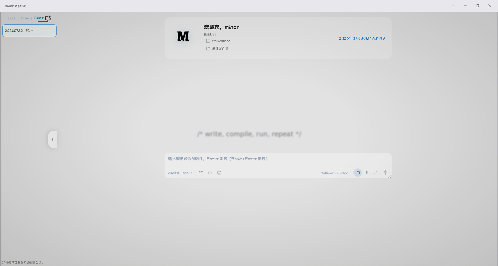

[功能亮点](#-功能亮点) · [快速开始](#-快速开始) · [项目架构](#-项目架构) · [开发手册](#-开发手册) · [LLM 推理服务](#-llm-推理服务)

</div>

---

## 📖 项目简介

**minor Agent** 最初按 Web 在线应用开发，后转为本地桌面应用开源。它不是又一个"对话框 + 联网搜索"的套壳 Agent，而是一个**以"工具执行 + 视觉闭环"为核心**的通用智能体：

> 🎓 **项目初衷**：这是一个 LangChain + LangGraph 的学习项目。基于两者构建 Agent 工作流，结构清晰、上手容易、扩展方便，适合作为 Agent 开发的参考实现。

- 🖥️ **真能操作桌面**：截图 → 视觉定位 → 键鼠模拟，闭环完成 ERP 录入、表单填写、软件操控
- 🧩 **20 项内置工具**：从终端命令到邮件收发，从 PPT 制作到图像生成，覆盖真实办公场景
- 🏠 **完全本地运行**：Electron 打包，数据不出本机；后端 FastAPI + 前端零延迟直读磁盘
- 🎨 **可深度定制**：主题 / 字体 / 字号 / 背景 / 工作空间 / 提示词分层架构，全部可调
- 🔁 **工程级稳定性**：循环检测、上下文压缩、阻塞式人工确认、轨迹回放，对抗 LLM 的"幻觉操作"
- 💾 **存储双后端（接口隔离）**：会话与定时任务存储统一接口驱动，**JSON 可视化 / MySQL** 一键切换、不双写；新增存储方式只需实现接口，消费方无感知后端

> 💡 项目演进：`Web 在线应用` → `Electron 桌面应用`。源码同一套 `src/`，既可由 `uvicorn` 作 Web 服务启动，也可由 Electron 主进程拉起，**双模式共用**。

<!-- 架构总览图占位 -->
<p align="center">
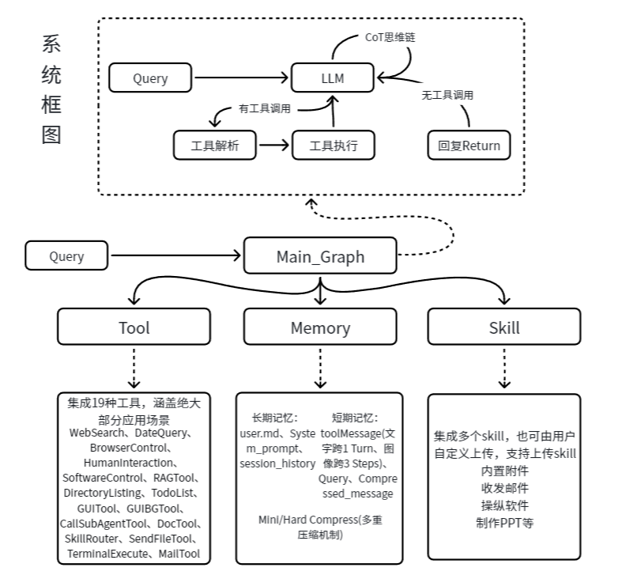
</p>

---

## ✨ 功能亮点

### 🛠️ 20 项工具能力

| 工具 | 文件 | 能力 |
|------|------|------|
| 🖱️ **gui** | `tools/gui.py` | 桌面 GUI 自动化：截图、视觉批量定位、点击/输入/快捷键/滚动 |
| 🌐 **browser_control** | `tools/browser_control.py` | 浏览器打开/关闭、地址导航、标签页交互 |
| 💻 **terminal_execute** | `tools/terminal_execute.py` | 执行任意终端命令，支持工作目录与超时 |
| 🪟 **software_control** | `tools/software_control.py` | Win32 API 启停软件、注册表、`os.startfile` |
| 📧 **email** | `tools/email.py` | IMAP 收邮件 + SMTP 发邮件（含附件） |
| 📄 **doc** | `tools/doc.py` | 创建/读取/编辑 docx / xlsx / pptx / pdf / txt |
| 📂 **directory_listing** | `tools/directory_listing.py` | 递归列目录、文件元信息 |
| 📨 **send_file** | `tools/send_file.py` | 以邮件附件形式发送本地文件 |
| 🔍 **web_search** | `tools/web_search.py` | 联网搜索（Tavily / Firecrawl / 火山引擎） |
| 🗄️ **text2sql** | `tools/text2sql.py` | 自然语言/SQL 操作数据库：查表结构、查询、增删改 |
| 📚 **rag** | `tools/rag.py` | ChromaDB 向量检索 + Reranker 重排序 |
| 🎨 **image_gen** | `tools/image_gen.py` | 调用 Z-Image-Turbo 生成图片 |
| ✅ **todo_list** | `tools/todo_list.py` | 多步任务规划与进度跟踪 |
| 🤝 **human_interaction** | `tools/human_interaction.py` | 阻塞式询问用户：收集信息 / 多选一，答案作为普通工具返回值 |
| 🤖 **agent_call** | `tools/agent_call.py` | 委派子 Agent 处理子任务 |
| 🧭 **skill_router** | `tools/skill_router.py` | 匹配并路由到预定义 Skill 流程 |
| 📅 **date_query** | `tools/date_query.py` | 当前日期时间查询 |
| ⏰ **cron_manager** | `tools/cron_manager.py` | 定时任务管理：查看/新增/修改/删除定时任务，支持 cron/间隔/一次性触发 |
| 📊 **hard_excel_read** | `tools/hard_excel_read.py` | 复杂 Excel 表结构读取：前 N 行原始数据 + 维度/合并区/数据区范围建议，供大模型解析结构 |
| 📥 **excel2sql** | `tools/excel2sql.py` | 按大模型给定的数据行列范围，将 Excel 数据区流式批量入库 MySQL（自动建库建表、表注释） |

### 🎯 区别于其他 Agent 项目的核心设计

| 设计点 | 多数 Agent 项目 | minor Agent |
|--------|----------------|-------------|
| **GUI 操作粒度** | 一步一调用，N 个动作 = 2N+1 次 LLM 调用 | **动作序列合并**：同页多操作打包为一次 `gui` 调用，N 个动作仅 2 次 LLM 调用 |
| **视觉反馈** | 仅返回坐标文本 | **截图作为视觉闭环**注入上下文，多模态 LLM 看到真实屏幕状态 |
| **坐标定位** | 逐元素请求 | **批量定位** `_batch_ground_elements`：N 个元素 1 次子模型调用 |
| **循环失控** | 无防护，token 烧穿 | **两级循环检测**：连续 3 次同工具警告反思 → 连续 5 次强制终止 |
| **上下文膨胀** | 简单截断 | **图内分级压缩**：token 超 `窗口×COMPRESS_RATE` 触发，压缩历史工具调用为累积摘要，每步 LLM 调用后检查 |
| **部署形态** | 仅 Web / 仅 API | **同一套源码双模式**：`uvicorn` Web 服务 ↔ Electron 桌面应用 |
| **文件操作** | HTTP 上传下载 | 桌面端走 **IPC 直读磁盘**，零延迟；Web 端走 `/api/fs/*` |
| **提示词** | 单层 system prompt | **四层提示词架构**：系统级 / 工具描述 / 运行时注入 / 内部子模型 |

### 🖼️ 运行界面

Agent 运行过程中的关键交互界面，支持文件从任意位置**拖拽到聊天区或编辑区**，灵活组织工作流：

<!-- 运行界面截图占位 -->
<p align="center">
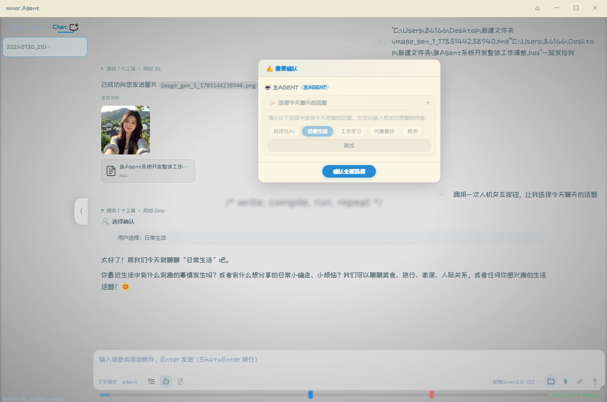
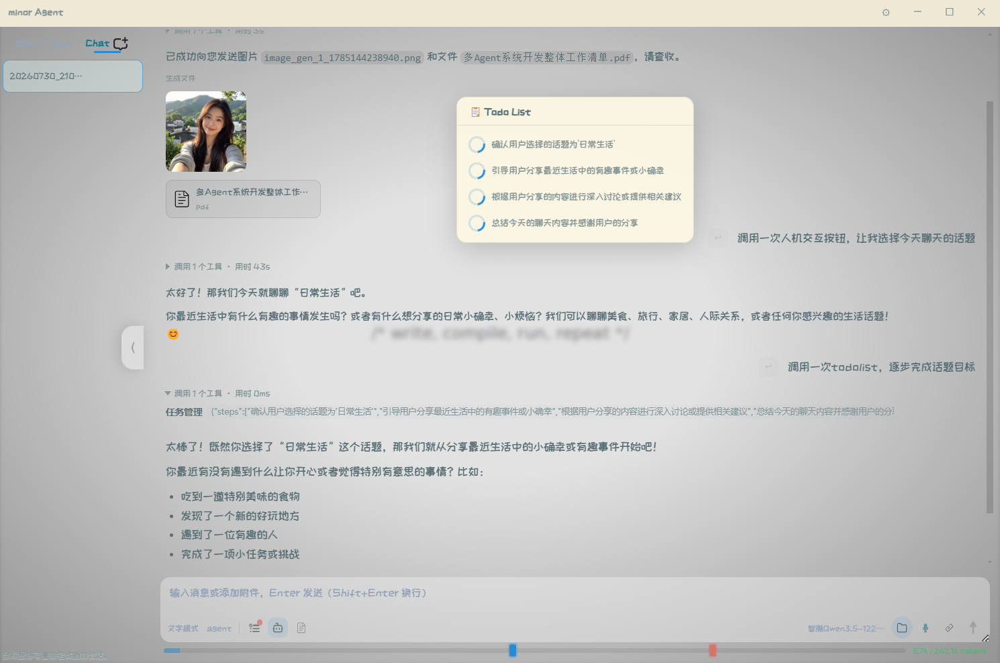
<br>
<sub><b>人机交互确认</b> — 敏感操作（终端执行、文件写入等）与信息收集以浮窗形式实时弹出，用户可同意、拒绝、跳过或补充信息；**拒绝也只是一次工具返回值**，Agent 自行调整方案继续，不会结束本轮&emsp;|&emsp;<b>任务规划 TodoList</b> — 多步任务自动拆解与进度跟踪，支持主 / 子 Agent 独立任务列表</sub>
</p>

<p align="center">
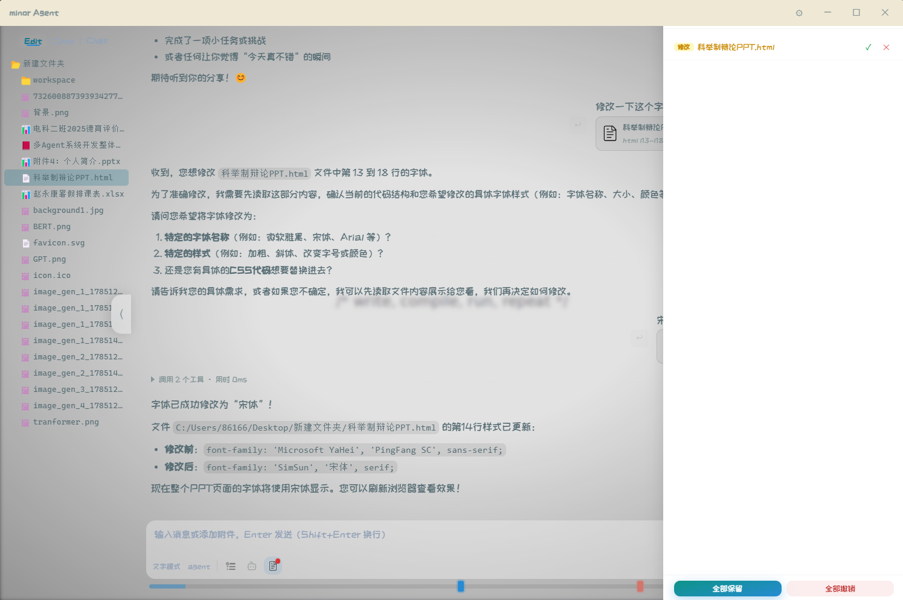
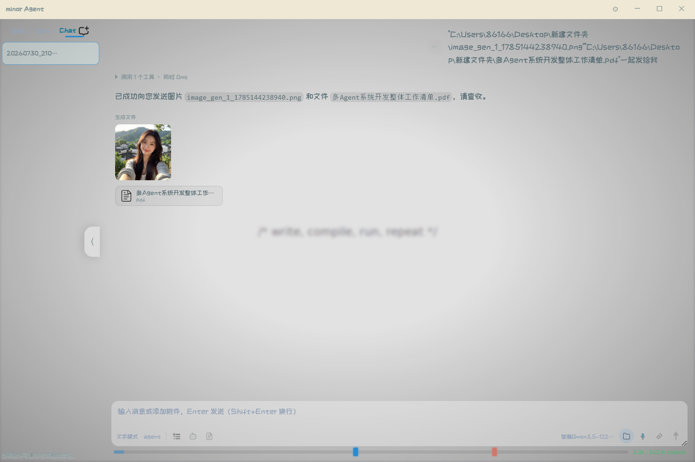
<br>
<sub><b>文件编辑模式</b> — 内置 Monaco 编辑器，支持代码高亮、差异对比、文件树拖拽组织&emsp;|&emsp;<b>工具调用记录</b> — 实时展示每轮 ReAct 的工具调用链、参数及返回值</sub>
</p>

<p align="center">
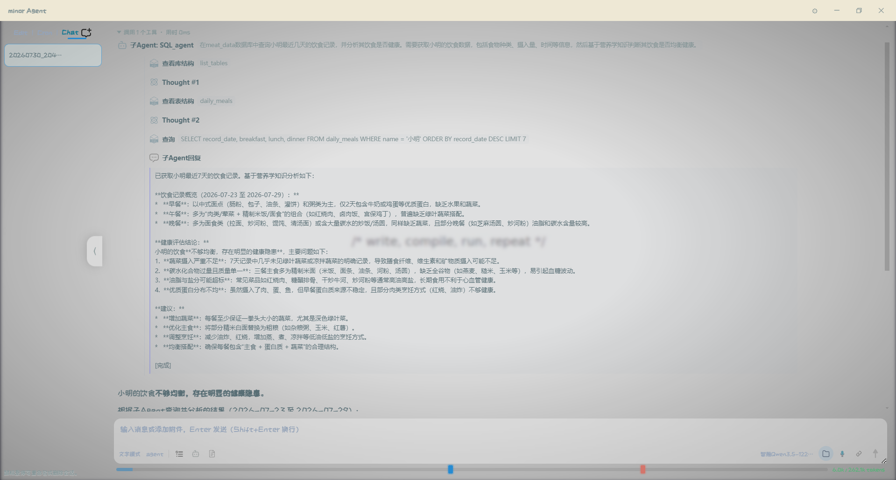
<br>
<sub><b>子 Agent 嵌套调用</b> — 主 Agent 委派子 Agent 执行子任务，工具调用以嵌套结构展示，思考过程穿插显示，支持展开/折叠查看详情</sub>
</p>

<p align="center">
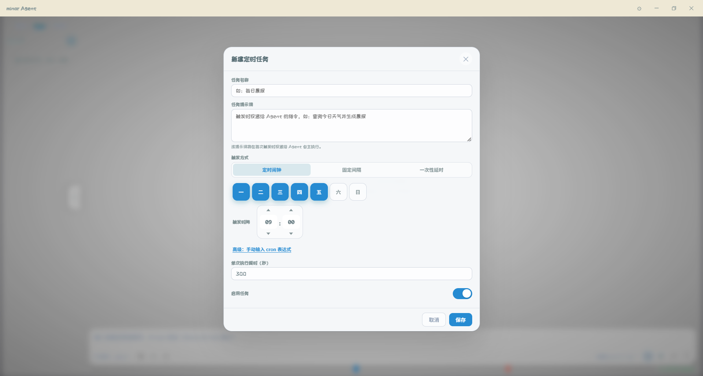
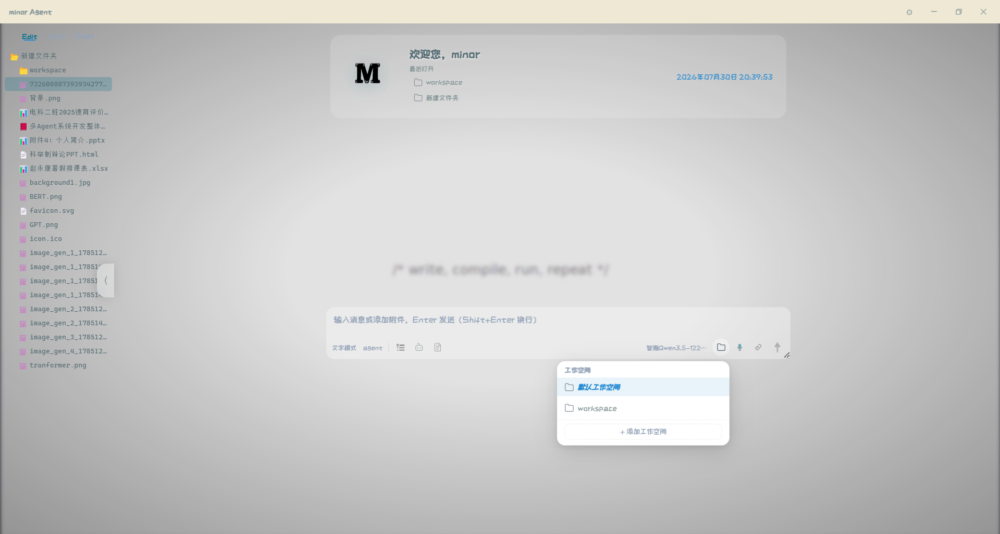
<br>
<sub><b>定时任务管理</b> — 支持 cron / 间隔 / 一次性三种触发方式，状态实时可见&emsp;|&emsp;<b>Edit 编辑模式</b> — 独立编辑区，Monaco 编辑器 + 文档树侧栏，支持拖拽文件/文件夹到附件区发送给 Agent</sub>
</p>

<p align="center">
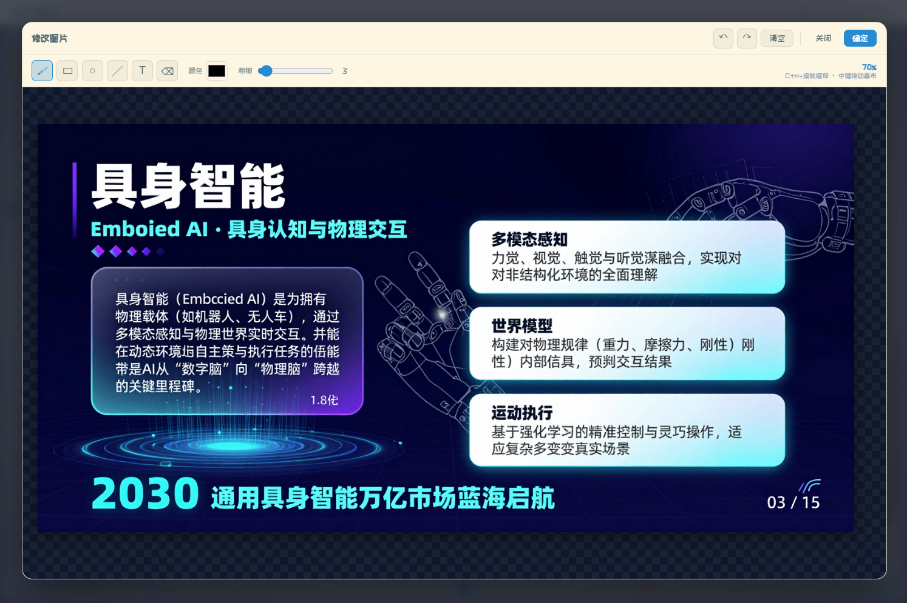
<br>
<sub><b>图片修改画板</b> — 附件图片缩略图 hover 显示删除按钮，点击图片打开预览浮窗，支持下载/修改/关闭；点击「修改」进入画板编辑器，在底图上使用画笔/矩形/圆形/直线/文字/橡皮擦进行标注编辑，Ctrl+滚轮缩放，中键拖动平移，支持撤销/重做，确定后替换原图</sub>
</p>

<p align="center">
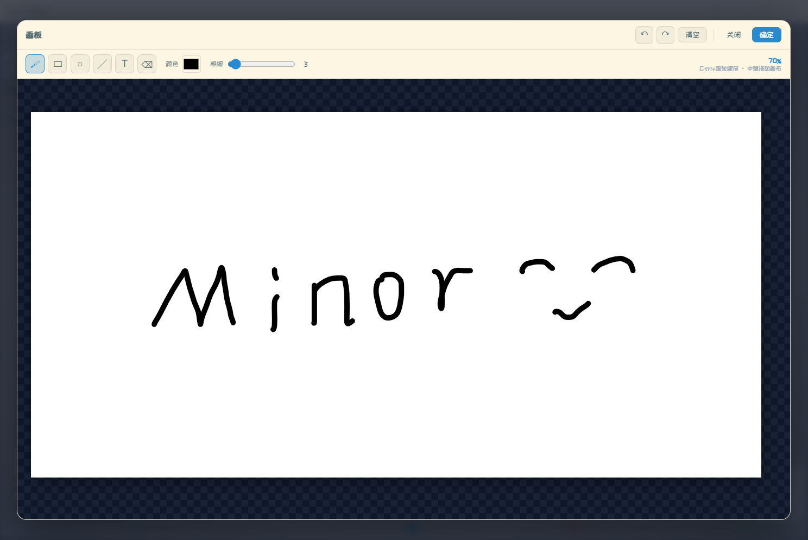
<br>
<sub><b>空白画板</b> — 输入区画板按钮一键打开 1536×768 空白画布，支持画笔/矩形/圆形/直线/文字/橡皮擦绘图，颜色与粗细可调，文字对象可拖拽/缩放/旋转，Ctrl+滚轮缩放画布，中键平移，完成导出为 PNG 自动添至附件区</sub>
</p>

---

## 🏗️ 项目架构

### 整体分层

```
┌──────────────────────────────────────────────────────────────┐
│                   Electron 主进程 (main.js)                    │
│   窗口管理 · 首次配置向导 · Python 生命周期 · 端口清理 · IPC    │
└───────────────────────────────┬──────────────────────────────┘
                                 │ spawn uvicorn (127.0.0.1:8765)
                                 ▼
┌──────────────────────────────────────────────────────────────┐
│                   FastAPI 后端 (web/server.py)                 │
│   会话管理 · 多模态收发 · SSE 流式 · 文件服务 · 工具调用推送    │
└───────────────────────────────┬──────────────────────────────┘
                                 │ turn_runner.start_turn()
                                 │（每会话一个后台线程，HTTP 请求
                                 │  挂载等待；断连不影响执行）
                                 ▼
┌──────────────────────────────────────────────────────────────┐
│                Agent 编排层 (agents/agent_runtime.py)          │
│   消息拼装 · 历史持久化 · 跨轮工具上下文 · 实时推送             │
└───────────────────────────────┬──────────────────────────────┘
                                 │ graph.invoke()
                                 ▼
┌──────────────────────────────────────────────────────────────┐
│            LangGraph ReAct 图 (core/graph.py)                 │
│   agent 节点 → tools 节点 → process_tool_artifact 节点         │
│   内含: 反思注入 · 压缩 · 循环检测 · 路由                      │
│   人机交互: 阻塞式普通工具（core/human_request.py）            │
└───────────────────────────────┬──────────────────────────────┘
                                 │ 调用
                                 ▼
┌──────────────────────────────────────────────────────────────┐
│             20 项工具 (tools/*.py) · 5 项技能 (skills/)        │
└──────────────────────────────────────────────────────────────┘
```

### ReAct 循环（图内）

```
START → [agent: call_model] ──有 tool_calls──▶ [tools: 并行工具节点] ──▶ [process_tool_artifact] ──▶ [compress]
              ▲                                      ▲                     │                            │
              │ 无 tool_calls                        │                     ◀────────────────────────────┘
              ▼                                      └── 子 Agent 结果 / 工具返回值注入 ◀── 并行工具节点（线程池）
             END
```

- **`call_model`**（`core/nodes.py`）：注入反思提示 → LLM 调用 → 每步检查压缩（token 超阈值标记）→ 提取 thinking
- **`should_continue`**（`core/routing.py`）：含 tool_calls → 循环检测 → 路由到 `tools` 或 `END`（需人工确认的工具不在此暂停，而是在工具执行钳点阻塞征求用户意见，见「阻塞式人机交互」）
- **`process_tool_artifact`**：gui 截图作为 synthetic HumanMessage 注入，实现视觉闭环
- **`compress`**（`core/nodes.py`）：token 超 `窗口×COMPRESS_RATE` 时，将历史工具调用压缩为累积摘要（见「实现细节」）

### 多 Agent 模式

多 Agent 并非独立图，而是**同一张 react 图内的工具级并行**：`tools` 节点由 `make_parallel_tool_node`（线程池）取代 ToolNode，一轮内的多个工具调用并行执行；其中 `agent_call` 工具会以主 Agent 当前消息快照启动**子 Agent 的独立图实例**执行子任务，结果以工具返回值注入主 Agent 上下文。子 Agent 内的人机交互同样为阻塞式——在子图线程中等待浮窗应答，完成后自然回到主图：

```
[agent] ──有 agent_call──▶ [tools: parallel_tool_node（线程池）]
                               │
                               ├─ 普通工具：直接并行执行
                               └─ agent_call：spawn 子 Agent Runtime → 子图 invoke
                                              │（子图内 human_interaction 阻塞等待
                                              │  浮窗应答，答案作为工具返回值）
                                              └─ 结果作为 ToolMessage 注入主 Agent ◄┐
          ▲                                                                          │
          └──────────────── 有 agent_call → 继续循环；无 → END ──────────────────────┘
```

---

## 📂 项目结构

```
Agent/
├── electron/                    # 🖥️ Electron 桌面端
│   ├── main.js                  #   主进程：窗口/IPC/Python生命周期/端口清理
│   ├── preload.js               #   安全桥接层：fs/dialog/window/Python setup API
│   └── setup.html               #   首次配置向导（3 步：Python环境 → LLM → 高级参数）
│
├── src/
│   ├── agent/                   # 🧠 Agent 核心
│   │   ├── agents/
│   │   │   └── agent_runtime.py #   编排层入口：execute_agent（动态 Agent 工厂）
│   │   ├── core/
│   │   │   ├── graph.py         #   LangGraph 构建（单 Agent + 多 Agent）
│   │   │   ├── nodes.py         #   ReAct 节点：call_model / process_tool_artifact / 压缩
│   │   │   ├── runtime.py       #   图执行器：消息拼装、历史加载、轨迹落盘
│   │   │   ├── routing.py       #   should_continue 路由 + 强制终止
│   │   │   ├── state.py         #   Graph 状态定义（messages / agent_mode）
│   │   │   ├── loop_detector.py #   循环检测：重复工具调用，两级响应
│   │   │   ├── human_request.py #   ★ 人工请求注册表：交互类工具的通用阻塞通道（ask_human）
│   │   │   ├── turn_runner.py   #   ★ 后台线程轮次执行器（解耦 HTTP 与图执行生命周期）
│   │   │   ├── llm.py           #   ChatQwen 多模态封装（图像/附件/非标准 tool_call）
│   │   │   ├── tool_policy.py   #   工具执行策略（直执 / 需确认）
│   │   │   ├── storage.py       #   ★ 统一存储层：接口 + JSON/MySQL 双实现 + 工厂 + scope
│   │   │   └── config_manager.py#   配置读写：agent/tool/env/gui/model/theme
│   │   ├── memory/
│   │   │   └── system_prompt.py #   ★ 四层提示词：MAIN / PLAN / REFLECTION / VISION...
│   │   ├── tools/               #   20 项工具（见上表）
│   │   │   ├── ...（gui / browser_control / terminal_execute / email / doc / web_search / text2sql / rag / cron_manager 等）
│   │   ├── cron/                 #   ⏰ 定时任务引擎
│   │   │   ├── models.py         #     数据模型（CronTask / Trigger）
│   │   │   ├── storage.py        #     转发层（实现统一在 core/storage.py）
│   │   │   ├── scheduler.py      #     调度计算与触发扫描
│   │   │   ├── runner.py         #     任务执行器（子进程，切换存储 cron 作用域）
│   │   │   └── live.py           #     常驻调度循环
│   │   ├── skills/              #   5 项技能（skill.json + skill.md）
│   │   │   ├── netease_mail_read/
│   │   │   ├── netease_mail_send/
│   │   │   ├── ppt_maker/       #   HTML 模板 → PPT（含 9 个附件文档 + 模板）
│   │   │   ├── taste/           #   代码生成界面美化
│   │   │   └── wechat_send_message/
│   │   ├── tts/
│   │   │   └── streaming_client.py  # 流式 TTS 客户端（SSE 收音频块）
│   │   ├── history/
│   │   │   ├── session_storage.py     # 转发层（实现统一在 core/storage.py）
│   │   │   └── tool_call_recorder.py  # 每轮工具调用轨迹记录 (tool_{turn_id}.json)
│   │   ├── utils/               #   env_utils / agent_utils / image_utils / ppt_utils / tool_call_utils
│   │   └── config/              #   ★ 配置文件目录
│   │       ├── env_config.json       #   运行时配置（首次向导生成，勿手动改）
│   │       ├── env_config_dist.json  #   配置模板（默认值）
│   │       ├── agent_config.json     #   Agent 行为配置 + 兜底 system_prompt
│   │       ├── tool_config.json      #   各工具启用/参数
│   │       ├── gui_config.json       #   GUI 工具参数
│   │       ├── theme_config.json     #   主题
│   │       └── workspace_config.json #   工作空间列表与当前选择
│   │
│   └── web/                     # 🎨 前端 UI
│       ├── server.py            #   FastAPI 后端（75+ 路由）
│       ├── ui_session.py        #   UI 会话状态管理
│       ├── index.html           #   主页面（侧边栏/聊天/编辑/Agent面板/操作栏）
│       ├── app.js / app.css     #   入口
│       ├── js/                  #   30 个前端模块（见开发手册）
│       ├── css/                 #   18 个样式模块 + variables.css 主题变量
│       ├── packages/            #   Monaco Editor 本地 npm 包
│       └── image/               #   SVG 图标资源
│
├── llm_server/                  # 🧠 LLM 推理服务（独立部署，详见该目录 README）
├── git_image/                   # 📸 README 展示图片
├── package.json                 # Electron + electron-builder 配置
├── requirements.txt             # Python 依赖
└── README.md                    # 本文件
```

---

## 🚀 快速开始

minor Agent 提供两种运行方式：**桌面应用（推荐）** 与 **Web 开发模式**。两者共用同一套 `src/` 源码。

### 方式一：桌面应用（推荐体验）

#### 1. 安装依赖

```powershell
cd C:\Users\86166\Desktop\Agent_Learning_minor\Agent

# 设置国内镜像（可选，加速 Electron 下载）
$env:ELECTRON_MIRROR="https://npmmirror.com/mirrors/electron/"

npm install
```

#### 2. 启动应用

```powershell
npm start
```

首次运行会弹出**配置向导**（3 步），写入 `src/agent/config/env_config.json` 后自动启动：

| 步骤 | 配置内容 | 说明 |
|------|----------|------|
| **Step 1** Python 环境 | 选择 / 自动检测系统 Python | 主进程会调用系统 Python 启动 uvicorn；可选自动 `pip install` 依赖 |
| **Step 2** LLM 设置 | `base_url` / `api_key` / `model` | 必填；可填任何 OpenAI 兼容端点 |
| **Step 3** 高级参数 | TTS / ASR / RAG / 搜索 / 压缩 / 循环阈值 | 可选；不填则对应能力禁用 |

> 💡 之后启动直接进入主界面，不再弹向导。如需重配，删除 `src/agent/config/env_config.json` 即可重触首次流程。

#### 3. 打包为安装程序

```powershell
# 设置镜像 + 自定义缓存目录后构建
$env:ELECTRON_MIRROR="https://npmmirror.com/mirrors/electron/"
$env:ELECTRON_BUILDER_CACHE="$PWD\electron-builder-cache"
npm run build
```

输出 `dist/minor Agent Setup 1.0.0.exe`，双击安装即可。安装包使用**系统 Python + 运行时安装依赖**方案，体积远小于打包完整 venv 的方案。

<details>
<summary>📦 打包原理（点击展开）</summary>

- `package.json` 的 `build.files` 仅打包 `electron/`、`src/`、`requirements.txt`，**排除** `env_config.json`（每个用户独立生成）
- `asar: false`：源码不加密，便于审计与二次开发
- NSIS 安装器：允许改安装目录、创建桌面/开始菜单快捷方式、卸载时清理 AppData
- 首次启动由 `setup.html` 向导引导：检测 Python → 配置 LLM → 写 `env_config.json` → 启动 FastAPI → 加载 UI
- 主进程 `findSystemPython()` 依次检查：用户配置路径 → 常见 Python 安装位置 → PATH 中的 `python`

</details>

---

### 方式二：Web 开发模式（调试用）

适合前端开发与快速迭代，无需 Electron。

```powershell
cd C:\Users\86166\Desktop\Agent_Learning_minor\Agent

# 1. 创建并激活虚拟环境
python -m venv myenv
.\myenv\Scripts\Activate.ps1          # Windows
# source myenv/bin/activate           # macOS / Linux

# 2. 安装依赖
pip install --upgrade pip
pip install -r requirements.txt

# 3. 配置环境（首次）
#    复制模板并填写 LLM 凭证
Copy-Item src\agent\config\env_config_dist.json src\agent\config\env_config.json
#    编辑 env_config.json，至少填写 models[].base_url / api_key / model

# 4. 启动 Web 服务
$env:PYTHONPATH="src;$env:PYTHONPATH"
uvicorn web.server:app --host 127.0.0.1 --port 8765 --reload

# 5. 浏览器打开
#    http://127.0.0.1:8765
```

<details>
<summary>🌐 （可选）公网暴露</summary>

```powershell
# 通过 Cloudflare Tunnel 临时暴露
cloudflared tunnel --url http://localhost:8765
```

</details>

---

## ⚙️ 配置说明

所有运行时配置集中在 `src/agent/config/env_config.json`，首次向导自动生成。关键字段：

| 字段 | 默认值 | 说明 |
|------|--------|------|
| `models[]` | `SETUP_REQUIRED` | LLM 列表：`{id, name, model, api_key, base_url, timeout, max_retries}` |
| `gui_model_id` | `""` | GUI 视觉定位专用模型（留空则回退主模型） |
| `WORKING_DIR` | 项目根目录 | 工作根目录（桌面端自动设为安装目录） |
| `WORKSPACE_DIR` | `""` | 工作空间目录（相对 WORKING_DIR），留空则使用 WORKING_DIR |
| `USER_PYTHON_PATH` | `""` | 指定 Python 解释器路径 |
| `LLM_CONTEXT_WINDOW` | `262144` | 上下文窗口大小（token） |
| `COMPRESS_RATE` | `0.6` | 上下文压缩阈值比例（0~1），token 用量超过 `窗口×该值` 时触发压缩 |
| `THINKING_LEVEL` | `"low"` | 深度思考档位：low / high / xhigh / max / ultra（xhigh 及以上启用深度思考） |
| `IMG_SIZE` | `768` | 截图短边尺寸 |
| `GROUNDING_WIDTH/HEIGHT` | `1000` | 视觉定位输入分辨率 |
| `LOOP_DETECT_REPEATED_TOOL_WARN` | `3` | 连续同工具同参多少次警告 |
| `LOOP_DETECT_REPEATED_TOOL_END` | `5` | 连续同工具同参多少次强制终止 |
| `RAG_CHUNK_SIZE / OVERLAP` | `500 / 50` | RAG 分块大小与重叠 |
| `IMAGE_GEN_URL` | `http://localhost:8904` | 图像生成服务地址 |
| `SEND_FILE_SIZE_LIMIT` | `30` | 发送文件大小上限（MB） |
| `WEB_SEARCH_API_KEY` | `""` | 联网搜索 API Key |
| `WEB_SEARCH_ENGINE` | `"tavily"` | 搜索引擎选择（tavily / firecrawl / volcengine） |
| `STORAGE_BACKEND` | `"json"` | 存储后端（json / mysql） |
| `MYSQL_HOST` / `MYSQL_PORT` / `MYSQL_USER` / `MYSQL_PASSWORD` / `MYSQL_DATABASE` | `""` | MySQL 连接参数（STORAGE_BACKEND=mysql 时生效） |
| `TOOL_TIMEOUT` | `300` | 工具执行超时时间（秒） |
| `CRON_TIME_PERIOD_MINUTES` | `30` | 定时任务时段长度（分钟），同一时段全局并发=1 |
| `ASR_BASE_URL` | `""` | 语音识别服务地址 |
| `STREAMING_TTS_URL` | `""` | 流式 TTS 服务地址 |
| `RAG_BASE_URL` | `""` | RAG 嵌入/重排序服务地址 |
| `EMAIL_ADDRESS / EMAIL_AUTH_CODE` | `""` | 邮箱凭证（IMAP/SMTP） |

> ⚙️ 以上参数均可在主界面「设置」面板热修改，或通过 `/api/config/*` 接口程序化调整。

设置面板包含五个标签页，覆盖 Agent 运行的全部可调参数：

<!-- 设置界面截图占位 -->
<p align="center">
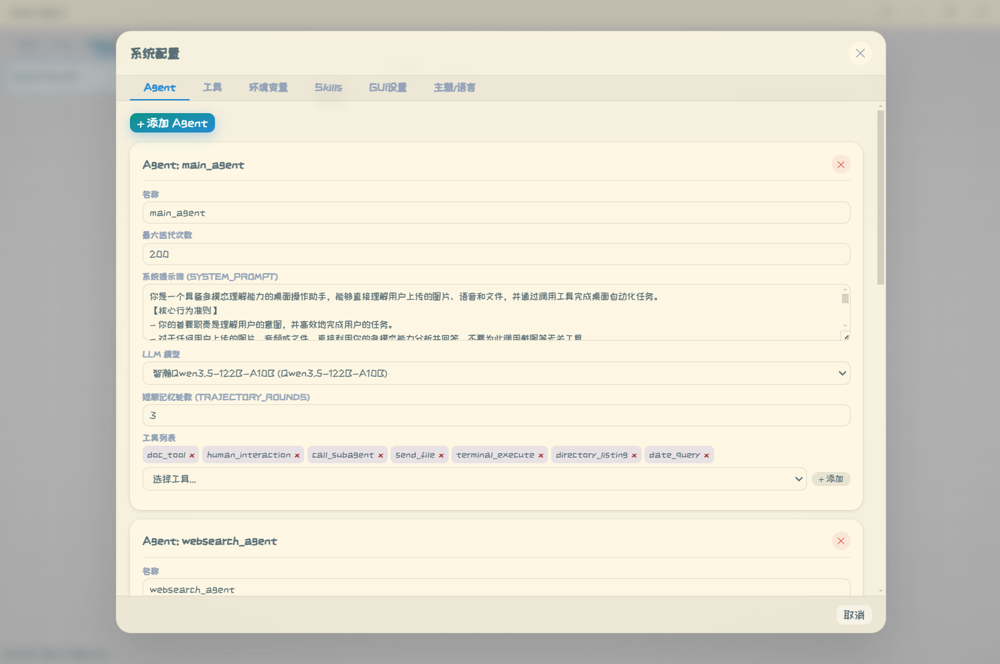
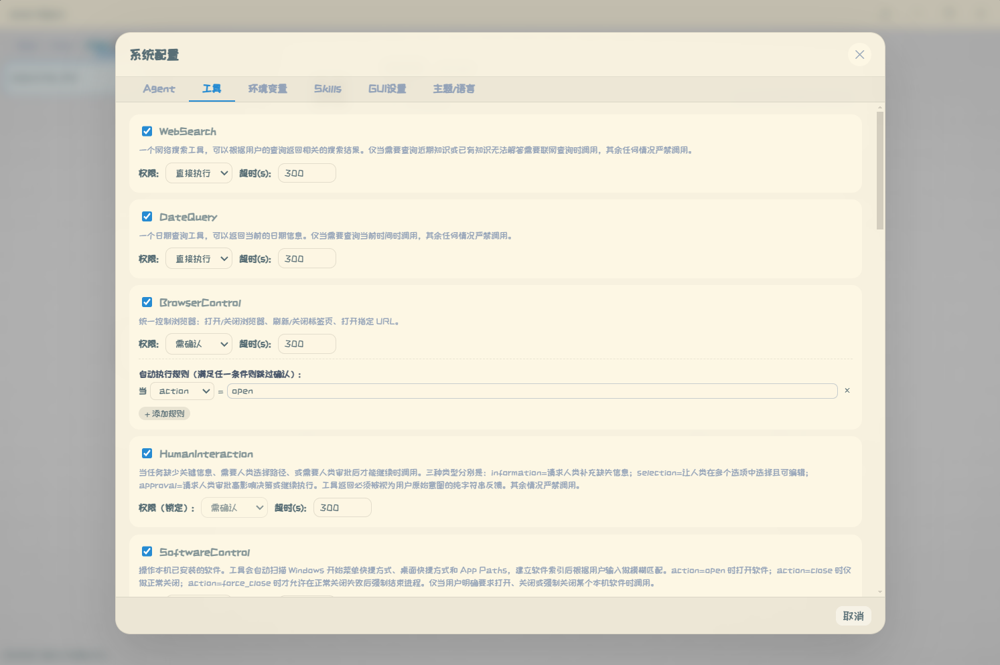
<br>
<sub><b>Agent 配置</b> — 管理多个 AI 角色，各自绑定独立模型与工具集&emsp;|&emsp;<b>工具配置</b> — 启用/禁用工具、调整参数及执行策略</sub>
</p>

<p align="center">
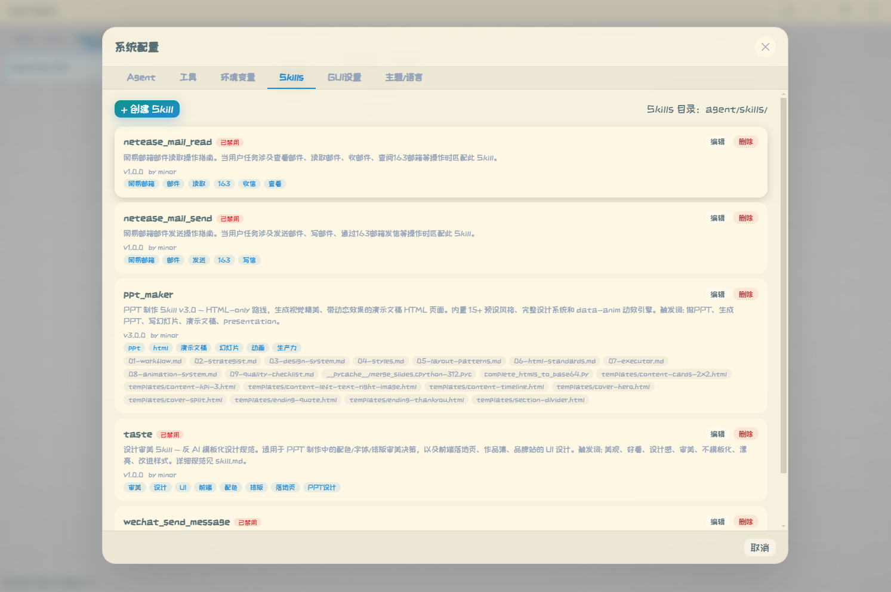
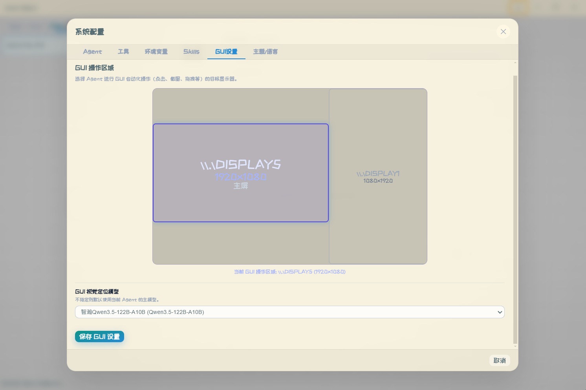
<br>
<sub><b>环境变量</b> — LLM 密钥、路径、压缩阈值等全局参数&emsp;|&emsp;<b>GUI 设置</b> — 选择 GUI 自动化操作的目标显示器</sub>
</p>

<p align="center">
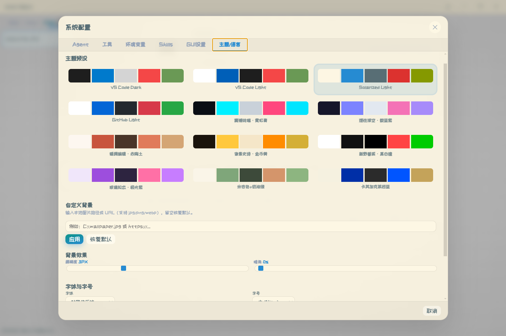
<br>
<sub><b>主题配置</b> — 12 套预设主题 + 自定义背景 / 模糊度 / 暗角 / 字体</sub>
</p>

---

## 🧠 实现细节

### 1. 四层提示词架构

| 层级 | 位置 | 注入时机 | 作用 |
|------|------|----------|------|
| **L1 系统级** | `memory/system_prompt.py` | 会话开始 | `MAIN_SYSTEM_PROMPT` 定义角色；`PLAN_MODE_PROMPT` 强制先规划 |
| **L2 工具描述** | 各 `tools/*.py` 的 `description` | 工具绑定时 | 指导 LLM 正确调用（含 one-shot 示例） |
| **L3 运行时注入** | `nodes.py` / `loop_detector.py` | 每轮 ReAct | `REFLECTION_PROMPT` 反思 + 反循环警告，作为 synthetic HumanMessage |
| **L4 内部子模型** | `gui.py` `_build_batch_prompt` | 工具内部 | 批量坐标定位，one-shot 强制纯坐标输出 |

### 2. 上下文分级压缩（图内）

<!-- 多级压缩机制图占位 -->
<p align="center">
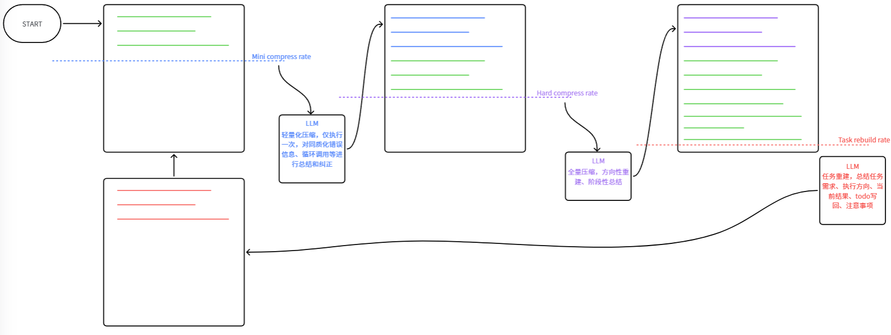
</p>

```
每次 LLM 调用后读取 response.usage_metadata.total_tokens
   ├─ 未超阈值        → 不处理，继续下一轮
   ├─ 主 Agent 超阈值 → 标记压缩，由 compress 节点统一执行：
   │    将注入的历史工具调用与返回压缩为累积摘要（RemoveMessage 移除已覆盖消息）
   └─ 子 Agent 超阈值 → 注入整理提示词，整理进度后直接返回主 Agent（子 Agent 不压缩）
```

- **触发**：`call_model` 内每步检查 `total_tokens`，超过 `LLM_CONTEXT_WINDOW × COMPRESS_RATE`（默认 0.6）即标记压缩
- **执行**：压缩发生在图内 `compress` 节点（`process_tool_artifact` 之后），只压缩注入的历史工具上下文，系统提示词与对话历史保留，摘要按压缩游标累积
- **子 Agent**：不做压缩，超限时整理任务进度直接返回主 Agent，避免上下文继续膨胀

### 3. 循环检测两级响应

| 级别 | 触发条件 | 响应 |
|------|----------|------|
| ⚠️ 警告 | 连续 3 次同工具同参 | 注入反思提示引导模型自我纠偏 |
| 🛑 终止 | 连续 5 次同工具同参 | `should_force_end()` 返回 END，向前端输出错误报告 |

### 4. 阻塞式人机交互（交互类 / 展示类工具的统一模式）

人机交互不再"暂停图 + 存快照 + 续跑"，而是**阻塞式普通工具**：工具在图上线程中等待前端浮窗应答，答案（同意 / 拒绝 / 跳过 / 补充信息）只是普通工具返回值，图自然继续——**拒绝不会结束整轮**，Agent 自行调整方案。

```
LLM 发出 human_interaction / 需确认工具调用
   → tools 节点执行工具
   → human_request.ask_human() 阻塞等待（注册到请求表，随 live snapshot 推送前端）
   → 前端浮窗出现，工具调用行显示"运行中"
   → 用户点击 → POST /api/human-action → 写入答案并唤醒
   → 工具返回答案文本 → ToolMessage → 图继续（无快照重放、无续跑状态机）
```

| 设计点 | 传统做法（本项目旧版） | 阻塞式（当前） |
|--------|----------------------|----------------|
| 图执行 | 请求线程内同步 invoke | 后台线程（`core/turn_runner.py`），断连/关页不影响执行，双发请求挂同一轮 |
| 等待答案 | 图 END + 消息快照存 `PENDING_TOOL_APPROVALS` | 工具内 `threading.Event` 阻塞（`core/human_request.py`） |
| 决策处理 | `continue_after_human_action` 重放快照续跑 | 答案即返回值，无续跑路径 |
| 拒绝 | 结束整轮（等同手动暂停） | 仅返回值，Agent 调整后继续 |
| 工具列表 | 确认时清空重建、续跑时重放 | 自然展示：等待中 `running` → 应答后 `done` |
| 子 Agent 交互 | 异常冒泡（`SubAgentPendingError`）+ 恢复状态机 | 子图线程内直接阻塞，完成自然回主图 |
| 无人值守（cron） | 悬死靠超时兜底 | `ask_human` 检测 headless 立即返回默认答案 |

**两类工具的扩展模式**（新增能力零框架改动）：

- **交互类工具**（如 `human_interaction`）：工具内调一次 `ask_human(meta)` 阻塞，自己格式化返回值
- **展示类工具**（如 `todo_list`）：纯文本返回、不维护全局 store，前端从通用 live 记录（工具调用的 args/结果）按工具名写一个小 adapter 渲染浮窗（如 `js/todo.js` 的 `updateTodoOverlayFromRecords`）

### 5. GUI 动作序列化（性能关键）

| 模式 | N 个动作的 LLM 调用次数 |
|------|------------------------|
| 单步执行（多数项目） | 2N + 1 |
| **序列合并（本项目）** | **2**（1 次批量定位 + 1 次决策） |

通过 `MAIN_SYSTEM_PROMPT` + `REFLECTION_PROMPT` 双重强调"同页操作必须合并为一次 `gui` 调用"实现。

### 6. 双模式源码共用

`src/web/` 同一套代码两种部署：

| | Web 模式 | 桌面模式 |
|---|---------|---------|
| 启动 | `uvicorn web.server:app` | Electron `spawn` uvicorn |
| 文件操作 | `/api/fs/*` HTTP | `electron-api.js` → IPC 直读磁盘 |
| 对话框 | 浏览器原生 | Electron `dialog` 模块 |
| 加载协议 | `http://` | `file://` + IPC |

前端通过 `window.electronAPI?.isElectron` 自动适配。

### 7. 存储双后端（JSON 可视化 / MySQL，统一接口隔离）

会话历史与定时任务存储统一在 **`agent/core/storage.py`**：接口（Protocol）驱动、双后端实现、**消费方零感知后端选择**（不判断 `STORAGE_BACKEND`）。

**接口与实现**
- `ConversationRecordRepository`（对话消息 / 工具调用 / 轮次元数据 / 会话生命周期，16 方法）与 `TaskConfigRepository`（cron 任务配置，6 方法）两个 Protocol
- 每后端一个实现类：`JsonRecordRepository` / `MysqlRecordRepository`（含会话与 cron 双作用域）、`JsonTaskConfigRepository` / `MysqlTaskConfigRepository`
- **新增存储后端只需实现上述接口并在工厂注册一行**；消费方新增功能/字段无需改动存储层（消息原样 JSON 存储、工具记录 meta 全量透传）

**作用域（scope）**
- `session`（默认）：主进程普通会话，JSON 落盘 `history/sessions/{session_id}/`，MySQL 用 `sessions / session_messages / session_tool_calls` 三表
- `cron`：定时任务，JSON 落盘 `history/cron/{task_id}/`，MySQL 用 `cron_messages / cron_tool_calls` 两表；cron 子进程切换存储作用域后**直写**记录，主进程经 cron 作用域仓库读取

| 后端 | 存储位置 | 说明 |
|------|----------|------|
| **json**（默认） | `history/sessions/{session_id}/` | 消息与工具调用以人类可读 JSON 文件落盘（`turn_{turn_id}.json` / `tool_{turn_id}.json` / `session_meta.json` / `_session_tokens.json`），可直接打开查看/修改，便于审计与调试 |
| **mysql** | session 三表 / cron 两表 | 消息与工具调用记录原样 JSON 入库、读取只走数据库；二进制产物（图片/附件等）两个后端均落盘 |

- 由 `STORAGE_BACKEND` + `MYSQL_HOST / MYSQL_PORT / MYSQL_USER / MYSQL_PASSWORD / MYSQL_DATABASE` 配置，`agent/core/db.py` 提供统一连接与幂等建表
- **不双写**：选哪种后端，读写就只走该后端；写入幂等（同一 `(session_id, turn_id)` 先 DELETE 再 INSERT）；DB 异常仅打印日志，不阻断主流程
- 分支（`/api/sessions/branch`）与回滚等会话功能均基于存储接口实现，两个后端一致可用

**双后端行为差异（设计内）**

| 场景 | json | mysql |
|------|------|-------|
| 轮次中实时工具记录 | 每次工具结果后**增量写盘** `tool_*.json`，进程崩溃后重启可回退恢复最近记录 | 不增量入库，由轮次结束 `save_tool_calls` 统一落库（无额外磁盘 IO，但崩溃时该轮记录丢失） |
| 服务重启后运行中轮次 | `get_live_tool_calls` 回退读取增量文件，可继续展示 | 内存记录丢失、数据库无该轮记录，实时面板为空 |
| cron 历史读取 | 直接读 `history/cron/` 下文件 | 子进程直写 cron 表，历史可正常读取 |

---

## 🔌 LLM 推理服务

项目自带一套 6 服务推理后端（`llm_server/`），可独立部署在 GPU 服务器上，为 Agent 提供 LLM / ASR / TTS / RAG / 图像生成能力。

| 服务 | 端口 | 模型 | 脚本 |
|------|------|------|------|
| LLM | 8900 | Qwen3.6-35B-A3B-FP8 | `start_llm.sh` |
| ASR | 8901 | Qwen3-ASR-1.7B | `start_asr.sh` |
| TTS | 8902 | VoxCPM | `start_streaming_tts.sh` |
| RAG | 8903 | Qwen3-Embedding-0.6B + Reranker-4B | `start_rag_server.sh` |
| Image Gen | 8904 | Z-Image-Turbo | `start_image_gen.sh` |

> 📄 完整部署、模型下载、测试方法见 **[llm_server/README.md](./llm_server/README.md)**。

> 💡 也可不自建推理服务，直接在配置向导填入任何 OpenAI 兼容 API（如云端 Qwen / DeepSeek / OpenAI）。

---

## 🛠️ 开发手册

### 前端模块职责（`src/web/js/`）

| 模块 | 职责 |
|------|------|
| `app.js` | 应用入口，初始化与事件绑定 |
| `api.js` | 封装所有后端 API 请求 |
| `state.js` | 全局状态管理 |
| `send.js` | 消息发送逻辑 |
| `chat-render.js` | 聊天消息渲染 |
| `cron.js` | 定时任务管理面板 |
| `sessions.js` | 会话列表管理 |
| `toolcalls.js` | 工具调用实时面板 |
| `todo.js` | TodoList 面板 |
| `edit-mode.js` | 编辑模式（Monaco） |
| `doc-tree.js` / `doc-mod-panel.js` | 文档树与修改面板 |
| `action-bar.js` | 底部操作栏 |
| `skills.js` | 技能管理 |
| `settings.js` | 设置面板 |
| `themes.js` | 主题切换 |
| `layout.js` | 布局与分隔条拖拽 |
| `electron-api.js` | ★ Electron IPC 适配层 |
| `file-preview.js` | 文件预览（图片/HTML/PDF） |
| `canvas-editor.js` | 画板编辑器（画笔/形状/文字/橡皮擦，支持缩放与图片修改） |
| `audio.js` | 语音录制与播放 |
| `i18n.js` | 国际化 |
| `token-ring.js` | 上下文 Token 用量环形指示器（含压缩阈值刻度与三类占比） |
| `access-mode.js` | 工作空间访问模式切换（限制访问 / 权限审查 / 完全访问） |
| `think-level.js` | 思考模式档位选择（low / high / xhigh / max / ultra） |
| `pending.js` / `pending-overlay.js` | 人工请求浮窗与决策提交（数据源为 live snapshot 的 `human_requests`） |
| `rollback.js` | 消息回滚 |
| `workspace.js` | 工作空间切换 |
| `dialog.js` | 对话框 |
| `utils.js` | 通用工具 |

### CSS 架构（`src/web/css/`）

`variables.css` 定义主题变量，其余按模块拆分：`base / layout / chat / composer / cron / dialog / settings / skills / todo / toolcalls / edit-mode / canvas-editor / audio / animations / pending / pending-overlay / toast / responsive`。

### 添加自定义工具

1. 在 `src/agent/tools/` 新建 `my_tool.py`，继承 LangChain `BaseTool`，实现 `_run`，填写 `name` / `description` / `args_schema`
2. 在 `tool_config.json` 注册并配置启用状态与参数（权限设为 `confirm` 时，工具执行前会自动弹出确认浮窗，同意后执行、拒绝/跳过作为返回值继续）
3. 交互类工具（需要向用户提问）在 `_run` 中调用 `core/human_request.ask_human(meta)` 阻塞等待答案；展示类工具（如进度面板）返回纯文本即可，前端从 live 工具记录按工具名写 adapter 渲染浮窗
4. 重启后端，工具自动绑定到 LLM

### 添加自定义技能

1. 在 `src/agent/skills/` 新建 `my_skill/` 目录
2. 编写 `skill.json`（名称、描述、标签）与 `skill.md`（操作流程，支持 `{SKILL_DIR}` 占位）
3. 可放 `attachments/` 附件（模板、脚本）
4. `skill_router` 会自动匹配并路由

### 同步 Web ↔ 桌面端

桌面端与 Web 端共用 `src/web/`。UI 改动无需同步；仅当分叉修改时手动合并。常用同步命令：

```powershell
# 桌面端 → Web 端（按需）
Copy-Item "src\web\index.html"      "src\web\index.html"      -Force
Copy-Item "src\web\css\*.css"       "src\web\css\"            -Force
Copy-Item "src\web\js\themes.js"    "src\web\js\themes.js"    -Force
```

### 调试技巧

- **后端日志**：桌面端 `npm start` 会在终端打印 `[FastAPI]` 日志
- **端口占用**：`main.js` 的 `killPortProcess(8765)` 启动前自动清理
- **重置配置**：删除 `src/agent/config/env_config.json` 重触首次向导
- **工具调用轨迹**：`history/sessions/{session_id}/tool_{turn_id}.json`

---

## ⚠️ 注意事项

| 事项 | 说明 |
|------|------|
| 🖥️ **平台** | 桌面自动化工具（`gui` / `software_control`）依赖 Win32 / pywin32 / pyautogui，**目前仅支持 Windows**；Web 模式下这些工具不可用 |
| 🐍 **Python 版本** | 建议 Python 3.11 / 3.12 / 3.13；首次向导会自动检测 |
| 🔐 **未签名安装包** | `.exe` 可能被 Windows Defender 拦截，点「更多信息 → 仍要运行」 |
| 🌐 **首次启动联网** | 加载 Google Fonts 需联网；离线环境字体选择器有 HTML 硬编码兜底 |
| 🔑 **API Key 安全** | `env_config.json` 含明文凭证，**勿提交到公开仓库**（已在 `.gitignore` 排除 `env_config.json`，仅保留 `env_config_dist.json` 模板） |
| 🎨 **图标** | 当前为 SVG，NSIS 打包后若显示默认图标，需准备 `.ico` 文件替换 `src/web/image/icon.ico` |
| 💾 **历史存储** | 默认会话历史与工具轨迹以 JSON 落盘在 `history/`（可切换 MySQL 后端），长期使用注意清理 |
| ⚡ **GUI 性能** | 同页多操作务必合并为一次 `gui` 调用，否则延迟显著（见「实现细节」） |

---

## 👥 Contributors

<!-- 新增贡献者请按此格式在下方追加一行：- [用户名](GitHub 个人链接)：贡献内容 -->

- [minor](https://github.com/minorQAQ)：项目话事人，主导整体架构设计与核心实现（LangGraph 编排、20 项工具体系、多 Agent 模式、上下文分级压缩、循环检测、Electron 桌面端等），完成大部分的开发工作。

---

## 📄 License

MIT License — 详见 [LICENSE](./LICENSE)。

<div align="center">

<sub>如果这个项目对你有帮助，欢迎 ⭐ Star 支持一下！</sub>

</div>
